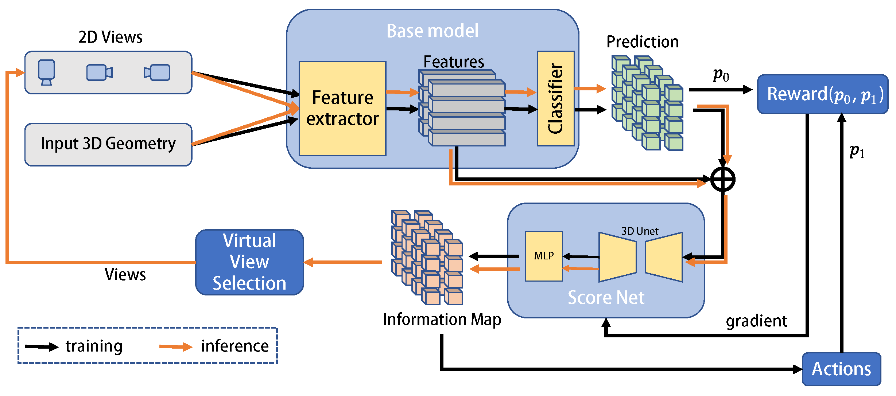

# Learning Virtual View Selection for 3D Semantic Segmentation
A pytorch implement of The paper “Learning Virtual View Selection for 3D Scene Semantic Segmentation”



## Introduction

we propose a general learning framework for joint 2D-3D scene understanding by selecting informative virtual 2D views of the underlying 3D scene. We feed both the 3D geometry and the generated virtual 2D views into any joint 2D-3D-input or pure 3D-input based deep neural models for improving 3D scene understanding. 

We have validated our proposed framework for various joint 2D-3D-input or pure 3D-input based deep neural models on ScanNet v2 and S3DIS, and the results demonstrate that our method obtains a consistent gain over baseline models and achieves new top accuracy for scene semantic segmentation.

The repo contains 3 subprojects to show the application of our work on different existing segmentation methods.

## Environment


```bash
# Torch
$ pip install torch==1.4.0+cu100 torchvision==0.5.0+cu100 -f https://download.pytorch.org/whl/torch_stable.html
# MinkowskiEngine 0.4.1
$ conda install numpy openblas
$ git clone https://github.com/StanfordVL/MinkowskiEngine.git
$ cd MinkowskiEngine
$ git checkout f1a419cc5792562a06df9e1da686b7ce8f3bb5ad
$ python setup.py install
# Others
$ pip install imageio==2.8.0 opencv-python==4.2.0.32 pillow==7.0.0 pyyaml==5.3 scipy==1.4.1 sharedarray==3.2.0 tensorboardx==2.0 tqdm==4.42.1
```

- install open3d following instructions in [Open3D – A Modern Library for 3D Data Processing](https://www.open3d.org/)

- For each subproject, refer to their requirements.txt or environment.yml for more details


## Prepare data

- Download the dataset Scannet and S3DIS on their official website. http://www.scan-net.org/ & http://buildingparser.stanford.edu/dataset.html
- use 2D data processing code /bpnet/prepare_2d_data.py for preprocessing 2D images of scannet dataset
- use 3D data processing code /bpnet/dataset/preprocess_3d_scannet.py to prepare 3d point clouds
- To train the base model with virtual views,  use bpnet/render/generate_virtualviews.py to generate virtual views with the same camera pose with original images.

## Training

#### BPNet

- download the initial model and put it into /bpnet/initmodel from 'resnet34': 'https://download.pytorch.org/models/resnet34-333f7ec4.pth'

- train the BPNet baseline with generated virtual views, use tools/train.sh and change data_root in /config/scannet/bpnet_5cm.yaml to your dataset root generated in bpnet/render/generate_virtualviews.py

- Train the virtual view selection framework:

  ​	`bpnet/tool/train.py --config=config/scannet/VVS_bpnet.yaml`

#### MVPNet

- pretrain the 2D network for MVPNet

  ```
  python mvpnet/train_2d.py --cfg configs/scannet/unet_resnet34.yaml
  ```

  you need also to change data_root of the images to your generated virtual images

- train MVPNet with virtual views

  ```
  python mvpnet/train_mvpnet_3d.py --cfg configs/scannet/mvpnet_3d_unet_resnet34_pn2ssg.yaml
  ```

#### VMNet

- pre-train the 2D semantic segmentation network with generated virtual views. The virtual views need to be orgnized as

  ```
  <datasets>
  |-- Scannet_virtual
      |-- <RGBFolder>
          |-- <name1>.jpg
      |-- <DepthFolder>
          |-- <name1>.jpg
          ...
      |-- <LabelFolder>
          |-- <name1>.<LabelFormat>
          ...
      |-- train.txt
      |-- test.txt
  ```

  

  - Pretrain weights:

    Download the pretrained segformer here [pretrained segformer](https://drive.google.com/drive/folders/10XgSW8f7ghRs9fJ0dE-EV8G2E_guVsT5?usp=sharing).

  - Config

    Edit config file in `configs.py`, including dataset and network settings.

  - Run the training

    ```
    $ CUDA_VISIBLE_DEVICES="GPU IDs" python -m torch.distributed.launch --nproc_per_node="GPU numbers you want to use" train.py
    ```

- pre-train the baseline with Scannet Dataset

  ```
  CUDA_VISIBLE_DEVICES=0 python run.py --train --exp_name name_you_want --data_path path/to/processed_data
  ```

  

## Inference

#### BPNet

```
bpnet/tool/test.py --config=config/scannet/VVS_bpnet.yaml
```

#### MVPNet

```
python mvpnet/test.py --cfg configs/scannet/VVS_mvpnet.yaml
```

#### VMNet

```
CUDA_VISIBLE_DEVICES=0 python /VMnet/run.py --val --exp_name val --data_path dataset/preprocessed
```

#### Visualization

​	you can use the following to see the visualized certainty map and segmentation results

```
<subproject>/scripts/vis_certainty.py
<subproject>/scripts/vis_results.py
```

#### checkpoints

you can download the [pre-trained checkpoints](https://cloud.tsinghua.edu.cn/d/bf0f7a4a6c1c456d9262/) and evaluate models on the validation set.

